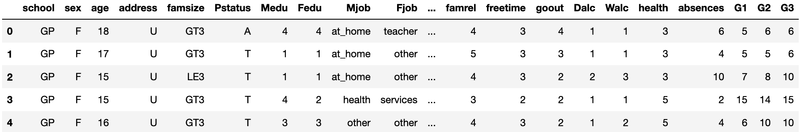
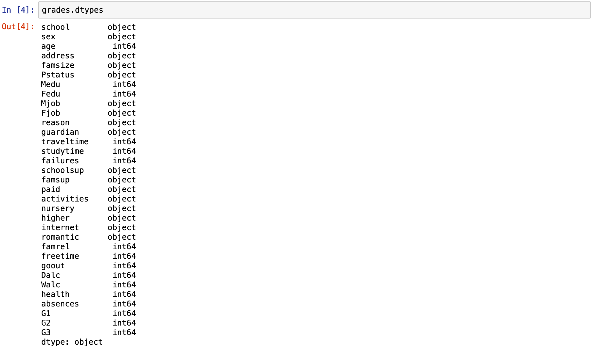

## Student Grade Prediction
##### by Sushant Deshpande

Machine Learning model to predict student's grades.

Libraries used:
    <li>Pandas</li>
    <li>Numpy</li>
    <li>Sklearn</li>

Task list:
- [x] Data Imported
- [x] Model built
- [ ] Front-end developed

The aim of this project is to build a model that would predict the grade a student might get based on certain features.

We begin with importing the csv file into our jupyter notebook.

Our data looks like this:

A look at datatypes reveals that we have `object` and `int64`:

> grades.dtypes

Let's create 2 new dataframes, one containing all the `object` columns and other containing all the `int64` columns.